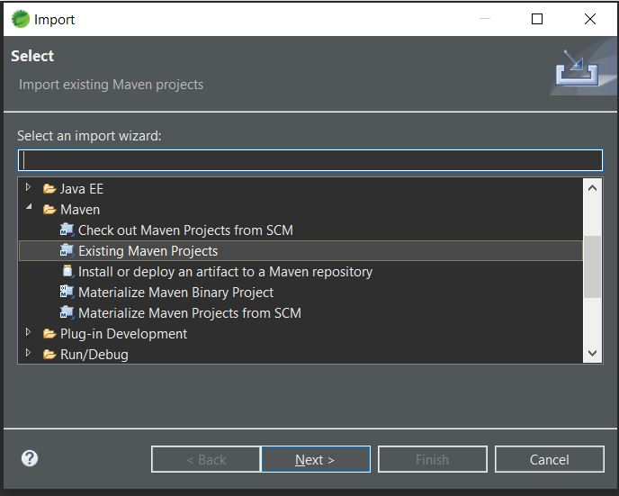
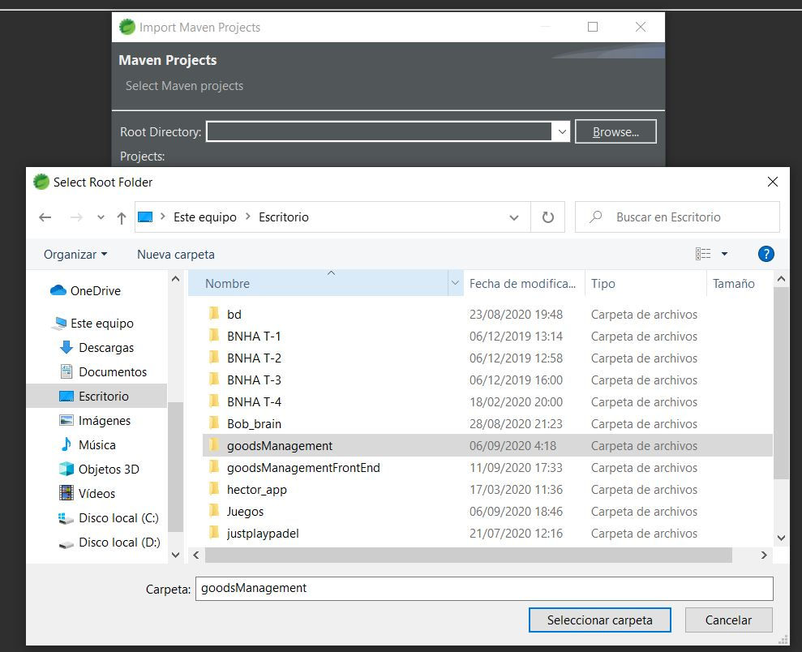
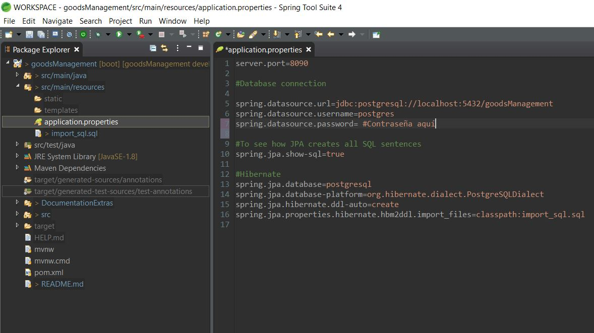

# Goods' Management Api: Bitbox Technical Test
## API Resources:

-----------------------------------------------------------------------
-----------------------------------------------------------------------
## Class Diagram:

## Description:

It is require to build an API that manages transactions of goods through different operations.

The elements that form this project are:

    ·   Products: constituyed by item code, description, price, state (active or discounted), Suppliers (Many to many), price reduction (one to many), creation date, creator(user||many to one)

    ·   Suppliers: the information needed from them are their names and countries.

    ·   Price Reduction: this element is formed by reduction price, starting date and end date (dates shouldn't overlap)

    ·   User: we will design a standard user with username, password(encrypted),role and a field to mark if the user is active.

    ·   Reports: this element will hold extra information on products.

Those elements will be used for completing the next tasks:

    ·   Login: An authentication access to the different operations.

    ·   Listing Items: The API returns a list of products (that could be filtered by state) displaying the item code, description,state,price,creationdate and creator of each one.
    
    ·   Detailled information from each item.

    ·   Item creation: The API creates an instance of a product with item code and description as mandatory fields, state is "active" by default, the creation date should be automatic.

    ·   Item edition: The API modify data from an item, all data should be editable. An option to associate a supplier should be included. An option to insert price reduction should be implemented.

    ·   Item deactivation: The API deactivates an item (changing its state to "Discounted") this requires the user to specify the reason for deactivation (this information will be storage on the element "Reports").

## User Manual (Spanish):

Esta aplicación está compuesta por PostgreSQL y Spring Boot de Java, como prerequisitos debemos tener ambas instaladas en nuestro ordenador.

Descargamos la version usada para esta implementación 
(http://www.enterprisedb.com/postgresql-tutorial-resources-training?cid=48). 

Una vez descargado, ejecutamos el instalador y se nos pedirá crear una contraseña que será la maestra para gestionar las conexiones.

Abrimos pgAdmin 4 e introducimos la contraseña para acceder a 'Servers' , 'PostgreSql 12' y damos botón derecho a 'Databases' y creamos la base de datos que se usará en nuestra API.

Descargamos también una IDE que nos permita programar en Java/Spring, en mi caso elegí STS 
(https://download.springsource.com/release/STS4/4.7.2.RELEASE/dist/e4.16/spring-tool-suite-4-4.7.2.RELEASE-e4.16.0-win32.win32.x86_64.self-extracting.jar).

Hacemos un git clone 
https://github.com/JoseNefilimSnow/goodsManagementBackend.git y descargamos el proyecto.

Tras instalarlo, en la esquina superior izquierda, seleccionamos "File", "Import" e importamos un proyecto de Maven:

y luego seleccionamos la carpeta del proyecto:

finalmente en el aplications.properties cambiamos los datos de el nombre de la base de datos (goodsManagement en mi caso) y la contraseña anteriormente elegida

Ahora solo quedaría iniciar la aplicación y se ejecutaría el servidor quien se encargaría de montar las tablas, relaciones y ejecutar un pequeño script sql que insertará diferentes ejemplos.
