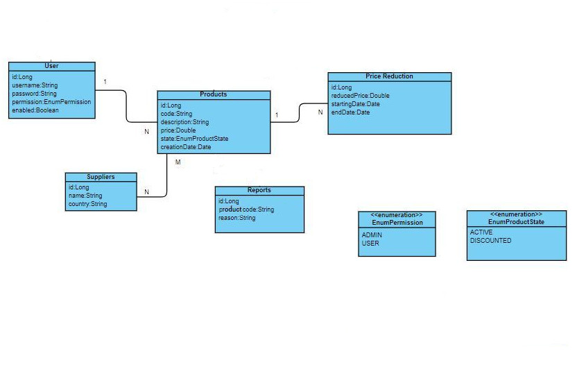

# Goods' Management Api: Bitbox Technical Test
## API Resources:

-----------------------------------------------------------------------
-----------------------------------------------------------------------
## Class Diagram:

## Description:

It is require to build an API that manages transactions of goods through different operations.

The elements that form this project are:

    ·   Products: constituyed by item code, description, price, state (active or discounted), Suppliers (Many to many), price reduction (one to many), creation date, creator(user||many to one)

    ·   Suppliers: the information needed from them are their names and countries.

    ·   Price Reduction: this element is formed by reduction price, starting date and end date (dates shouldn't overlap)

    ·   Ticket: on this element we will mark the operation (buy/sell), the products, total price and a date.

    ·   User: we will design a standard user with username, password(encrypted),role and a field to mark if the user is active.

    ·   Reports: this element will hold extra information on products.

Those elements will be used for completing the next tasks:

    ·   Login: An authentication access to the different operations.

    ·   Listing Items: The API returns a list of products (that could be filtered by state) displaying the item code, description,state,price,creationdate and creator of each one.
    
    ·   Detailled information from each item.

    ·   Item creation: The API creates an instance of a product with item code and description as mandatory fields, state is "active" by default, the creation date should be automatic.

    ·   Item edition: The API modify data from an item, all data should be editable. An option to associate a supplier should be included. An option to insert price reduction should be implemented.

    ·   Item deactivation: The API deactivates an item (changing its state to "Discounted") this requires the user to specify the reason for deactivation (this information will be storage on the element "Reports").

